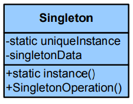

# Patrones de Diseño en Python (II)  - Patrones de Creación


## Patrones de creación

Los patrones creacionales proporcionan varios mecanismos de creación de objetos que incrementan la flexibilidad y la reutilización del código existente.

Los patrones de creación abstraen la forma en la que se crean los objetos, permitiendo tratar las clases a crear de forma genérica dejando para más tarde la decisión de qué clases crear o cómo crearlas.

### Singleton

Nuestro sistema requiere que una determinada clase sólo pueda ser instanciada una vez. Esto es útil cuando varios clientes desean utilizar una funcionalidad que es proporcionada por un único objeto. Nuestro objetivo será garantizar que la clase en cuestión no pueda generar más de una instancia y proporcionar un punto de acceso fijo a la misma.

**Se aplica cuando:**

Nuestro sistema tiene una clase que sólo deba ser instanciada una vez.
Dicha clase requiere de un punto de acceso global y conocido.

**Solución y Estructura:**

Para que éste escenario sea posible debemos asegurarnos que nuestra clase es instanciada si y sólo si no ha sido instanciada antes. Para controlar esta característica debemos hacer que el constructor sea privado, es decir, regulamos la instanciación de la clase dentro de la misma clase.

Para acceder a la clase debemos crear un atributo estático que represente una instancia de la misma, que debe ser de tipo privado. El acceso al atributo se hará desde un método público y estático que, en caso de no estar instanciado el atributo que representa la instancia, lo crea y en caso de que dicho atributo ya esté instanciado, lo devuelve.

> Garantiza que una clase sólo tenga una instancia, y proporciona un punto de acceso global a ella.



**Singleton:** Es la única clase que participa en este patrón (a parte de las clases cliente que la utilicen). Está compuesta de:

- **instance:** atributo que representa la instancia única de la clase.
- **Singleton():** constructor privado de la clase.
- **getInstance():** método público que crea (en caso de no existir) o devuelve una instancia a la propia clase.


Consecuencias:

POSITIVAS:
Reduce el espacio de nombres, mejorando la utilidad proporcionada por las variables globales.
Control de acceso a la instancia única.
NEGATIVAS:
En sistemas distribuidos se debe establecer un control de acceso.

##### La clase Singleton


```python
class Singleton():

    _instance = None
    _value = 0

    @classmethod
    def get_instance(cls): # Constructor alternativo que retorna una nueva instancia
        if not cls._instance:
            cls._instance = cls()
        return cls._instance

    def get_value(self):
        return self._value

    def set_value(self, v):
        self._value = v
```

Sólo existe una sóla instacia, por ello, tanto el objeto "A" como el objeto "B" son la misma instancia de la clase singleton.


```python
A = Singleton.get_instance()
B = Singleton.get_instance()
print("¿A es el mismo objeto que B?: ", A is B)

```

    ¿A es el mismo objeto que b ?:  True
    


```python
print(f'A: {A._instance}\nB: {B._instance}')
```

    A: <__main__.Singleton object at 0x000001E85F92CEF0>
    B: <__main__.Singleton object at 0x000001E85F92CEF0>
    

Comprobación accediendo al valor de ```_value```:


```python
B.set_value(10)
print(A.get_value())
```

    10
    

##### Singleton como Decorador


```python
def singleton(cls):

    instances = dict()

    def wrap(*args, **kwargs):
        if cls not in instances:
            instances[cls] = cls(*args, **kwargs)
        return instances[cls]

    return wrap
```


```python
@singleton
class Admin():

    def __init__(self, name, hours):
        self.name = name
        self.hours = hours
        _value = 0

    def get_value(self):
        return self._value

    def set_value(self, v):
        self._value = v
```


```python
admin1 = Admin("Jaime", 1)
admin2 = Admin("Jordi", 4)
```


```python
print("¿admin1 es el mismo objeto que admin2?: ", admin1 is admin2)
```

    ¿admin1 es el mismo objeto que admin2?:  True
    


```python
admin1.set_value(2)
admin2.get_value()
```


    2


La instancia es la misma, por tanto los parametros introducidos en el ```admin2``` no tienen efecto


```python
admin1.name, admin2.name, admin1.hours, admin2.hours
```


    ('Jaime', 'Jaime', 1, 1)


***

### Prototype

En algunos casos, el coste de crear un objeto nuevo desde 0 es muy elevado, y más aún si luego hay que establecer una gran colección de atributos. En éste contexto sería más conveniente clonar un objeto predeterminado que actúe de prototipo y modificar los valores necesarios para que se ajuste a su nuevo propósito.

**Se aplica cuando:**

La creación de nuevos objetos acarrea un coste computacional elevado..
Los objetos a crear tienen o suelen tener atributos que repiten su valor.

**Solución y Estructura:**

La solución consistirá en definir una interfaz que expone el método necesario para realizar la clonación del objeto. Las clases que pueden ser clonadas implementarán esta interfaz, mientras que las clases que deseen clonar deberán utilizar el método definido en la interfaz.


> Especifica los tipos de objetos a crear por medio de una instancia prototípica, y crear nuevos objetos copiando este prototipo.


- **Prototype:** Interfaz que define la operación de clonado. Será implementada por todos los objetos que puedan ser clonados. En ocasiones es implementado como una clase abstracta.

- **Client:** Crea nuevos objetos mediante la clonación de los mismos.

- **ConcretePrototype1:** Clase que puede ser instanciada mediante la clonación de un prototipo. Implementa la interfaz Prototype.

- **ConcretePrototype2:** Otra clase con las mismas características que ConcretePrototype1.

**Consecuencias:**

- POSITIVAS: 
    - Clonar un objeto es mucho más rápido que crearlo.
    - Un programa puede añadir y borrar dinámicamente objetos prototipo en tiempo de ejecución.
    - El cliente no debe conocer los detalles de cómo construir los objetos prototipo.
- NEGATIVAS:
    - En objetos muy complejos, implementar la interfaz Prototype puede ser muy complicada.

##### Prototipo

Tenemos que lanzar ofertas de trabajo similares para nuestra empresa. Para crear nuevas ofertas de trabajo modificaremos únicamente el nombre, la descripción y el jefe. Empezamos con el prototipo:


```python
from abc import ABC, abstractmethod
from copy import copy, deepcopy

class Employee(ABC):
    
    def __init__(self):
        self.__description__ = ""
        self.__name__ = ""
        self.__boss__ = None

    def hello(self):
        return f'Job Offer: {self.__name__},\n\
        Description: {str(self.__description__)}.\n\
        Your boss is: {self.__boss__.get_name()}\n'

    def set_boss(self, boss):
        self.__boss__ = boss;

    def get_boss(self):
        return self.__boss__
    
    def change_boss(self, name):
        self.__boss__.set_name(name)

    def set_description(self, description):
        self.__description__ = description;
    
    def get_description(self):
        return self.__description__

    def get_name(self):
        return self.__name__

    def set_name(self, name):
        self.__name__ = name;

    def clone(self):
        return deepcopy(self)

```


```python
class Junior(Employee):
    pass

class Senior(Employee):
    pass

class Expert(Employee):
    pass

class Boss():

    def __init__(self, name):
        self.__name__ = name

    def get_name(self):
        return self.__name__;
    
    def set_name(self, name):
        self.__name__ = name;
```

##### Fabrica de Prototipos

Construcción de los prototipos concretos para cada oferta de trabajo:


```python
class JobOffersCreator():
    def __init__(self):
        self.__junior__ = Junior()
        self.__senior__ = Senior()
        self.__expert__ = Expert()
        
        self.__junior__.set_boss(Boss("JS"))
        self.__junior__.set_description("engineer to be trained")
        self.__junior__.set_name("Industrial Engineer")
        
        self.__senior__.set_boss(Boss("JS"))
        self.__senior__.set_description("Technical engineer")
        self.__senior__.set_name("Industrial Engineer")
        
        self.__expert__.set_boss(Boss("JB"))
        self.__expert__.set_description("Technical Manager FA")
        self.__expert__.set_name("Industrial Engineer")

    def retrieve_job_offers(self, employee):
        
        if "Expert" == employee:
            return self.__expert__.clone()
        
        elif "Senior" == employee:
            return self.__senior__.clone()
        
        elif "Junior" == employee:
            return self.__junior__.clone()
        
        else:
            raise Exception("Sorry, employee not implemented")
```

El método ```main()``` hará de cliente y creará distintas ofertas de trabajo a partir de los prototipos.


```python
# main.py

creator = JobOffersCreator()

job_offers = []
for i in range(1):
    job_offers.append(creator.retrieve_job_offers("Expert"))
for i in range(2):
    job_offers.append(creator.retrieve_job_offers("Senior"))
for i in range(1):
    job_offers.append(creator.retrieve_job_offers("Junior"))
    
for i in job_offers:
    print(i.hello())
```

    Job Offer: Industrial Engineer,
            Description: Technical Manager FA.
            Your boss is: JB
    
    Job Offer: Industrial Engineer,
            Description: Technical engineer.
            Your boss is: JS
    
    Job Offer: Industrial Engineer,
            Description: Technical engineer.
            Your boss is: JS
    
    Job Offer: Industrial Engineer,
            Description: engineer to be trained.
            Your boss is: JS
    
    

Modificación de instancias una vez han sido creadas:


```python
job_offers[1].change_boss("MG")
job_offers[1].set_name("Computer Engineer")

print(job_offers[1].hello())
```

    Job Offer: Computer Engineer,
            Description: Technical engineer.
            Your boss is: MG
    
    

***

### Abstract Factory

Crear diferentes familias de objetos abstrayéndonos de los detalles de su creación.

**Se aplica cuando:**

Hay previsión de que se incluirán nuevas familias de objetos.
Existe dependencia (teórica) entre los tipos de objetos.

**Solución y Estructura:**

La solución será elaborar una interfaz para crear familias de objetos relacionados sin especificar sus clases concretas.

> Proporciona una interfaz para crear familias de objetos o que dependen entre sí, sin especificar sus clases concretas.


- **Cliente:** Es el usuario de la factoría, y deberá elegir la factoría adecuada, es decir, lo que quiere es obtener una instancia de alguno de los productos (ProductoA, ProductoB).

- **AbstractFactory:** Define las interfaces de las factorías, provee un método para la obtención de cada objeto que pueda crear (crearProductoA() y crearProductoB())

- **Factorías Concretas:** Representan las diferentes familias de productos, proveen la instancia concreta que se encarga de crear.

- **Producto abstracto:** Interfaz para productos genéricos. En el diagrama son ProductoA y ProductoB. El cliente trabaja directamente con esta interfaz, que será implementada por los diferentes productos concretos.

- **Producto concreto:** Implementación específica de los diferentes productos.

**Consecuencias:**

- POSITIVAS:
    - Flexibilidad al aislar las clases concretas.
- NEGATIVAS:
    - Para añadir nuevas familias hay que modificar tanto las clases abstractas como las concretas.

##### Factoria Abstracta

Como ejemplo, crearemos distintos tipos de Microcontrolador (AMD o Intel) utilizando la Factoria Abstracta. 

A continuación crearemos una interfaz Fabricante, que permitirá crear Microcontroladores a toda clase que la implemente:


```python
from abc import ABC, abstractmethod

class FabricaAbstracta(ABC):

    @abstractmethod
    def crearMemoria(self):
        pass
    @abstractmethod
    def crearProcesador(self):
        pass
```

Dispondremos de una fábrica principal (la factoría abstracta) que se encargará de invocar a las fábricas concretas de cada tipo de Microcontrolador. Evidentemente tendremos que definir dichas fábricas concretas que implementarán la clase Fabricante:


```python
class FabricaAMD(FabricaAbstracta):

    def crearMemoria(self):
        return MemoriaAMD()

    def crearProcesador(self):
        return ProcesadorAMD()

class FabricaIntel(FabricaAbstracta):

    def crearMemoria(self):
        return MemoriaIntel()

    def crearProcesador(self):
        return ProcesadorIntel()
```

Crearemos la clase abstracta que nos permitirá representar a cualquier tipo de Microcontrolador y definirá las operaciones que cualquier fabrica de Microcontroladores puede realizar:


```python
from abc import ABC, abstractmethod

class Memoria(ABC):
    def implementacion(self):
        print("..instalando memoria")

    @abstractmethod
    def operacion(self):
        pass

class Procesador(ABC):
    def implementacion(self):
        print("..instalando procesador")

    @abstractmethod
    def operacion(self):
        pass
```

Cada tipo de Microcontrolador implentará esta clase abstracta:


```python
class MemoriaAMD(Memoria):

    def operacion(self):
        print("....operando memoria AMD")

class ProcesadorAMD(Procesador):

    def operacion(self):
        print("....operando procesador AMD")

class MemoriaIntel(Memoria):

    def operacion(self):
        print("....operando memoria Intel")

class ProcesadorIntel(Procesador):

    def operacion(self):
        print("....operando procesador Intel")

```

Procedemos a utilizarlos en el ```main.py```


```python
# main.py

fabrica = FabricaAMD()
partes = [fabrica.crearMemoria(), fabrica.crearProcesador()]

for p in partes:
    p.implementacion()
    p.operacion()
```

    ..instalando memoria
    ....operando memoria AMD
    ..instalando procesador
    ....operando procesador AMD
    

***

## Referencias bibliográficas
1. Design Patterns. Elements of Reusable Object-Oriented Software - Erich Gamma, Richard Helm, Ralph Johnson, John Vlissides - Addison Wesley (GoF- Gang of Four)
2. Patrones de Diseño, Diseño de Software Orientado a Objetos - Joaquin Garcia. http://www.ingenierosoftware.com/analisisydiseno/patrones-diseno.php.
3. Patrones de diseño -  http://es.kioskea.net/contents/genie-logiciel/design-patterns.php3.
4. Introducción al diseño con patrones – Miguel Lagos Torres. http://www.elrincondelprogramador.com/default.asp?pag=articulos/leer.asp&id=29.
5. Object Oriented Desing “Software Desing Principles and Design Patters, http://www.oodesing.com
6. Daza Corredor, Alejandro Paolo, https://github.com/apdaza/patrones-gof-python_


---

**Autor**:
- [PortFolio | Jaime Sendra Berenguer](https://www.jaimesendraberenguer.com/)


<table class="tfo-notebook-buttons" align="left">

  <td>
    <a target="_blank" href="https://www.linkedin.com/in/jaisenbe/">Linkedin</a>
  </td>
  <td>
    <a target="_blank" href="https://github.com/jaisenbe58r">GitHub</a>
  </td>
  <td>
    <a target="_blank" href="https://medium.com/@jaimesendraberenguer">Medium Blog</a>
  </td>
  <td>
    <a target="_blank" href="https://www.kaggle.com/jaisenbe58r">Kaggle</a>
  </td>
</table>
